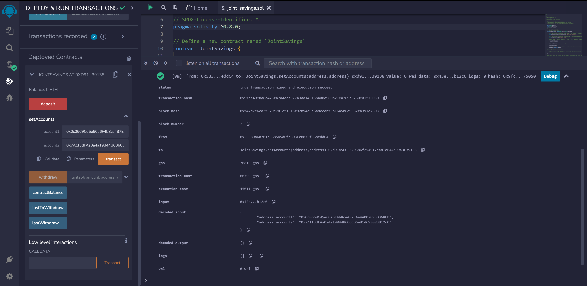
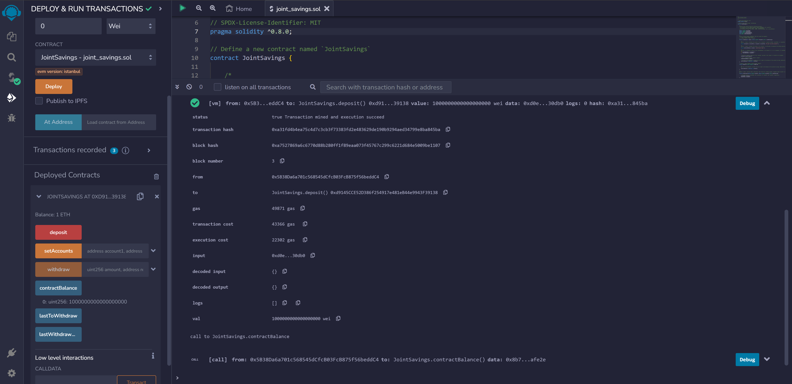
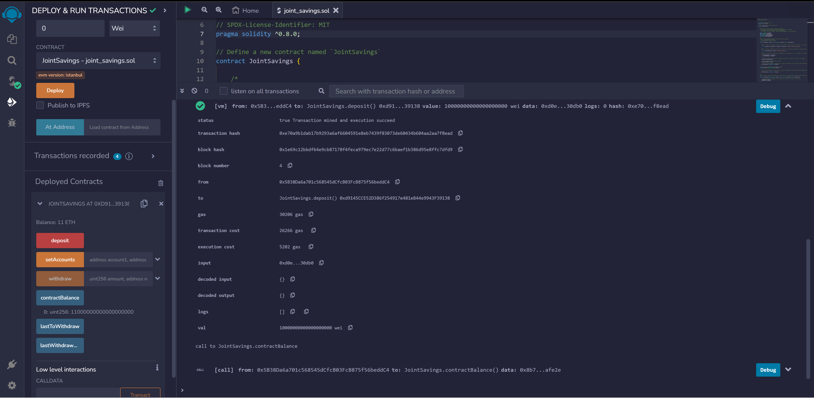
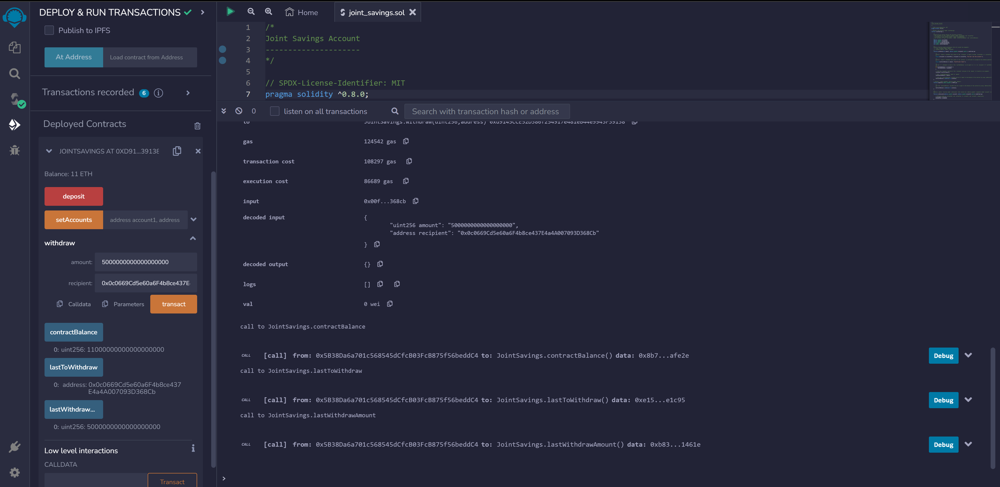
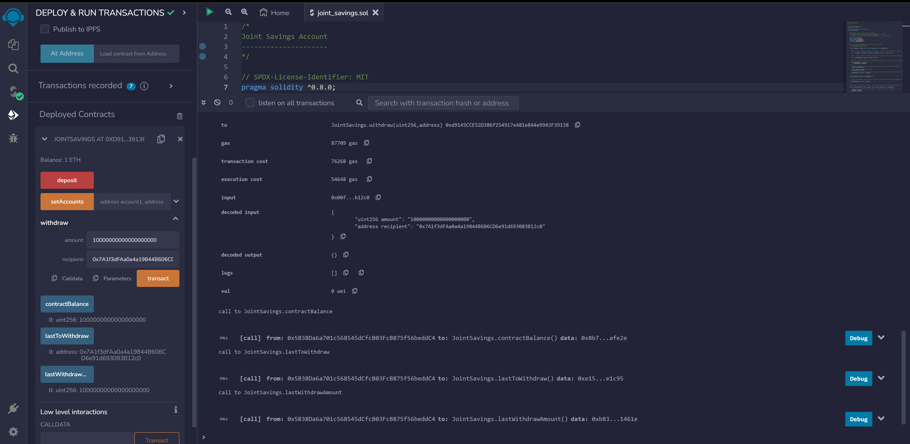

# Smart Contracts: Joint Savings Account
The aim of this project is to build a smart contract on the Ethereum blockchain to host joint savings accounts. 

## About
Smart Contracts on the Ethereum network allows the automation of many common financial processes and features. The automation of such features on the blockchain means that it recieves all the benefits of blockchain technology, such as being able to verify the integrity of every transaction. Solidity is used to create the smart contract that will automate the joint savings accounts. Each account will have two addresses, one for each user, and the ability to deposit and withdraw funds from the account.

## Getting Started
To run the application, you need to use an Ethereum IDE such as [Remix](https://remix.ethereum.org/)

## Usage

You can clone or download this GitHub project and open the `joint_savings.sol` using any IDE of your choice, one being Remix.

Ensure that the compiler is using solidity version 0.8.0.

Deploy the contract using any JavaScript VM and interact with the Deployed Smart Contract.

# Report
## Testing the Deployed Smart Contract

### Defining Authorized Ethereum Addresses

Using the `setAccounts` function, define the authorized Ethereum addresses that will be able to withdraw funds from the contract.

    

### Verifying the Deposit Functionality

Testing the deposit functionality of the smart contract by sending varying amounts of ether. After each transaction, use the `contractBalance` function to verify that the funds were added to the contract.

| |
|:--:|
|*Transaction 1: Send 1 ether as wei.*|

| |
|:--:|
|*Transaction 2: Send 10 ether as wei.*|

| |
|:--:|
|*Transaction 3: Send 5 ether.*|

### Verifying the Withdraw Functionality

 Testing the contract’s withdrawal functionality by withdrawing 5 ether into `accountOne` and 10 ether into `accountTwo`. After each transaction, use the `contractBalance` function to verify that the funds were withdrawn from the contract. Also, use the `lastToWithdraw` and `lastWithdrawAmount` functions to verify that the address and amount were correct.

| |
|:--:|
|*Transaction 1: Withdraw 5 ether into `accountOne`*|

| |
|:--:|
|*Transaction 2: Withdraw 10 ether into `accountTwo`*|

## Contributor
Andy Vu